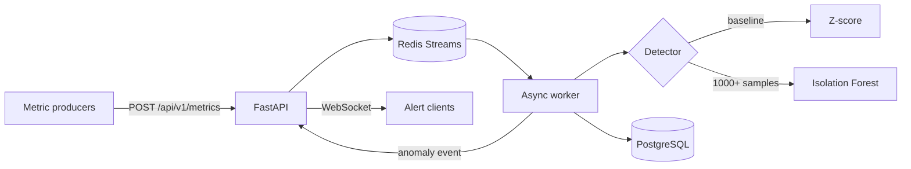

# Real-Time Anomaly Engine

An event-driven backend for ingesting service metrics, learning a baseline, and streaming anomaly alerts to connected clients.

The project demonstrates a complete asynchronous data path: FastAPI accepts validated metrics, Redis Streams buffers them for a worker, PostgreSQL keeps the audit trail, and a WebSocket channel delivers detected anomalies. The detector starts with a z-score fallback and switches to an Isolation Forest after enough history is available.

## Architecture



### Processing flow

1. Pydantic validates request volume, error rate, latency, timestamp, and source metadata.
2. The API appends the payload to a Redis consumer-group stream and returns `202 Accepted`.
3. The worker evaluates the metric vector and persists both the source event and any detected anomaly.
4. Successfully processed stream entries are acknowledged.
5. Anomaly events are broadcast to clients connected to `/ws/alerts`.

## Technical decisions

- **Redis Streams instead of an in-process queue:** ingestion and processing can fail or scale independently without losing the queue abstraction.
- **Consumer-group acknowledgements:** a message is acknowledged only after processing and persistence complete.
- **Two-stage detector:** z-scores make cold starts useful; Isolation Forest handles multivariate patterns after the history is large enough.
- **Pure detection module:** model fitting and evaluation live in `detector.py`, separate from database and network side effects, so edge cases can be unit tested.
- **Async I/O throughout:** FastAPI, Redis, PostgreSQL, and worker-to-API calls use asynchronous clients.

## Run locally

Requirements: Docker and Docker Compose.

```bash
cp .env.example .env
docker compose up --build
```

The API is available at `http://localhost:8000`; interactive API docs are at `http://localhost:8000/docs`.

To send a baseline, inject a spike, and listen for its alert:

```bash
python simulate_stream.py
```

## API surface

| Endpoint | Purpose |
| --- | --- |
| `POST /api/v1/metrics` | Validate and enqueue a metric payload |
| `WS /ws/alerts` | Stream anomaly events to connected clients |
| `POST /api/internal/broadcast_alert` | Relay worker alerts inside the Compose network |

Example ingestion payload:

```json
{
  "transaction_id": "txn_1042",
  "client_id": "checkout-api",
  "timestamp": "2026-09-24T10:00:00Z",
  "channel": "web",
  "region": "ap-south-1",
  "metrics": {
    "request_volume": 240,
    "error_rate": 0.018,
    "latency_ms": 84.2
  }
}
```

## Tests

The unit suite covers cold-start behavior, feature-level z-score flags, constant baselines, and malformed feature vectors.

```bash
python -m pytest -q
```

`test_engine.py` is an end-to-end demo client and expects the Docker Compose stack to be running.

## Repository map

```text
main.py             FastAPI ingestion and WebSocket service
worker.py           Redis consumer, persistence, retraining, and alerts
detector.py         Pure model-fitting and detection logic
schemas.py          Request validation contracts
database.py         Async PostgreSQL pool lifecycle
init.sql            Metrics and anomaly tables
simulate_stream.py  Local end-to-end traffic simulation
test_detector.py    Deterministic unit tests
docker-compose.yml  API, worker, Redis, and PostgreSQL services
```

## Current boundaries

This is a portfolio-grade distributed-systems prototype, not a production monitoring service. Before production use it would need authentication and authorization, protection for the internal broadcast route, dead-letter/retry handling, observability, idempotency guarantees, per-tenant models, load tests, and a deployment-specific secrets strategy.
